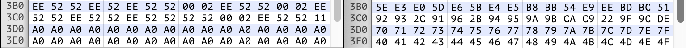

# Below the Root analysis

We'll start our analysis from "Below the Root (4am crack)", 4am's deprotected copy of Below the Root for the Apple \]\[, available on Asimov. There is a [san inc ProDOS](https://mirrors.apple2.org.za/ftp.apple.asimov.net/images/games/collections/san_inc_prodos/) port on Asimov, but it hangs if you play as any character other than Neric.

Side A can be CATALOGed from a standard DOS disk. The catalog looks normal, although in a disk editor, there are some sectors containing data that appear not associated with DOS. Side B is completely filled with orphaned sectors.

It seems that all files on Side A are encrypted somehow; loading them from a standard
DOS disk, or an external program like `applecommander`, results in garbage. In particular,
`LOAD WIND` (which could be a short BASIC HELLO program), will hang. Probably this version of
DOS has been modified to obfuscate or encrypt its file contents. We'll call this BTRDOS.

The first order of business is to boot into side A with DOS still connected, so we can
try to use it to read these files.  Breaking into the boot process with Control-Reset
doesn't work as DOS is disconnected or damaged. But we notice the flash of the Applesoft prompt
`]` during boot, as if DOS is running HELLO. Let's guess that `WIND` is `HELLO` and see what
happens if we remove it. I created a copy of side A called `a.dsk` and used
`applecommander` to delete `WIND`.

```sh
cp "Below the Root (4am crack) side A.dsk" a.dsk
applecommander -d a.dsk WIND
```

With `a.dsk` in drive 1, the system boots into BTRDOS and leaves us at the `]` prompt.

## The loading screen

Let's load `WINDHAM` first, since we deleted `WIND`.

```
]BLOAD WINDHAM
```

It must load around screen address $0400, because the text screen gets overwritten with garbage,
except for a message at the bottom: "PLEASE WAIT WHILE THE PROGRAM LOADS". That's the
message we get in the lores loading screen, so this is probably a lores screen dump.

```
]GR
]BLOAD WINDHAM
```


Yep. BTRDOS can clearly load and unscramble files with normal DOS commands, so we can examine them now, and later figure out what BTRDOS is doing differently. (Note: trying this again a few months later, no BASIC commands work at all when booting from `a.dsk`, only DOS commands. It's unclear how GR worked earlier.)

Actually, there's already a tantalizing clue. While the lores screen is BLOADing, the screen contains garbage, and suddenly at the end it snaps into sense.


Well, that's strange! This leads me to a hunch: maybe instead of unscrambling the file on the fly, it loads the entire file into memory, then unscrambles it in place. It's not unscrambling after every sector read, because the screen is 4 sectors long, yet unscrambles at once. So, it's very possible BTRDOS may have added a descrambler subroutine call to the end of the standard DOS BLOAD (which is also used by LOAD).

If that hunch is correct, then if we load `WINDHAM` from a regular DOS disk, it should load the scrambled version into memory. We can then check that visually against the scrambled version in the gif above by pausing the emulator, or running it a few times.

So, insert a regular DOS 3.3 disk in D1, and put an unmodified BTR side A in D2, and boot.

```
... boot into normal DOS 3.3 system disk in D1, BTR in D2 ...
]GR
]BLOAD WINDHAM,D2
```


That matches perfectly, which pretty much confirms our theory. The interesting part is the text portion: you can easily match where the loading message is (inverse) and the blank spaces (the alphabet). You can even see the spaces in the loading message (particularly the C, G and O columns). This looks more obfuscated than encrypted, and reminded me of the [ECB Penguin](https://blog.filippo.io/the-ecb-penguin/). It doesn't look like a scrambled letter depends on any previous letter, given the uniformity in the alphabet runs, and that "UVW" occurs both after `RST` and `37'`. But it's not a simple XOR with a constant byte either, or the spaces would all turn into the same letter.

So at a glance, I'm thinking there may be an XOR with both a constant key and an address, or something along those lines. I'm also guessing we can crack this without looking at the code, and we'll get to that in a bit.

## HELLO

It looks like we can unscramble `WIND` now, so we can put
- our working disk into D1 (`a.dsk`, BTR side A with `WIND` removed)
- BTR side A into D2 (which has `WIND`)

and boot up.

```
]LOAD WIND,D2
]LIST

 300  HOME : POKE 230,32: CALL 62450
      : HGR: POKE 49234,0
      : PRINT CHR$ (4);"BLOAD WINDHAM"
      : POKE 49238,0: POKE 49235,0
 400  PRINT  CHR$ (4);"BLOAD DIRECT.SECTOR"
 460  PRINT  CHR$ (4);"BLOAD SCREEN,A$4000"
 500  PRINT  CHR$ (4);"BLOAD NOMORE,A$100"
 510  PRINT  CHR$ (4);"BLOAD BIGMESS,A$330"
 530  PRINT  CHR$ (4);"BLOAD GAME1,A$A00"
 540  PRINT  CHR$ (4);"BLOAD GAME2,A$6000"
 900  CALL 23296
```

Eureka!

Line 330 clears hires page 1 to black, and sets fullscreen hires graphics, to mask the loading of `WINDHAM`. It then switches to lores mixed mode to show the loading screen. Then it loads a bunch of stuff and jumps into assembly language.

## Saving files

Now, it turns out they only modified LOAD/BLOAD to decrypt, but SAVE/BSAVE were unmodified: those write unencrypted files. Without understanding the scrambling algorithm, we can save files to regular DOS disks in their unscrambled form.

Assume you booted off `a.dsk` and swap it with BTR side A (just so WIND is available). Insert a normal, DOS3.3 formatted floppy in disk 2. Then you can write an unencrypted file like:

```
]LOAD WIND
]SAVE WIND,D2
```

The same works with BSAVE. However some of the files are at odd locations, like $400 or $100. These you would need to load and save somewhere else, like $6000, and modify the file header to load at the correct address. For example, one option using AppleCommander and a single work disk is:

```
]BLOAD WINDHAM,A$6000
]BSAVE WINDHAM6000,A$6000,L$400,D2
applecommander -g work.dsk WINDHAM6000 > WINDHAM
applecommander -p work.dsk WINDHAM B 0x400 < WINDHAM
applecommander -d work.dsk WINDHAM6000
```

The files on side A with their addresses and lengths:

```
NOMORE,A$100,L$B0              # overlaps stack
DIRECT.SECTOR,A$300,L$30
BIGMESS,A$330,L$D0             # overlaps vectors
WINDHAM,A$400,L$400            # overlaps screen and screen holes
GAME1,A$A00,L$4600             # overlaps hires 1 (length should be $3600)
SCREEN,A$4000,L$2000           # overlaps hires 2
GAME2,A$6000,L$3600
```

(Note that GAME1 length should be $3600; its last $1000 bytes overlap SCREEN, and are the same as SCREEN's first $1000 bytes.)

After copying all unscrambled files from side A to a new work disk, the resulting disk is bootable and lets you start a new game. At this time, it asks you to momentarily swap side A back in. If you insert the copy here, your character will be invisible. The original works here (even if you booted off the copy), so we're missing something there, and it could be those orphaned sectors we mentioned at the top.

The side A orphaned sectors are T05,S00..T09,S0F (middle of nowhere) and T12,S0D (middle of WIND). I copied T05S00..T09S0F (via Locksmith) over and it then started a game as expected. We'll see later that each of the 5 tracks T05..09 contains data for 1 of the 5 characters.

## Enciphering algorithm

We were able to unscramble the files with BLOAD/BSAVE, but it might come in handy to know what it's doing. Let's compare the unscrambled and scrambled versions of `WINDHAM`.


`WINDHAM` starts with a run of 11's to represent the red border. Identical plaintext bytes are deadly and might let us solve the mystery right away. First, the scrambled bytes also start at 11, and more or less count up. Every $10 bytes, the first digit changes. This looks  consistent with the data being XORed with the low byte of the address, without any key material. Here's a few unscrambled bytes (U) XORed with the low address byte (A) to get the scrambled byte (S), or `U XOR A = S`.

```
U  XOR A  = S
11 XOR 00 = 11
11 XOR 01 = 10
11 XOR 02 = 13
11 XOR 03 = 12
11 XOR 10 = 01
11 XOR 11 = 00
11 XOR 20 = 31
0E XOR 30 = 3E
B9 XOR B9 = 88
```

I'm convinced. But there are two more questions: first, is the high address byte used?



Here's the end of `WINDHAM` at offset $03B0. Now I'll XOR the 2 bytes together to confirm the result is just the low address byte, meaning the high byte does not come into play.

```
U  XOR S  = A
EE XOR 5E = B0    # $03B0
52 XOR 92 = C0    # $03C0
A0 XOR 78 = D8    # $03D8
A0 XOR 4F = EF    # $03EF
```

Second, is it using the load address, or the relative file offset? We can look at `BIGMESS`, which is loaded at A$0330.

```
0000: 4c 36 03 4c f5 03 c9 03 d0 68 20 0c 60 29 c1 a0   # unscrambled
0000: 4c 37 01 4f f1 06 cf 04 d8 61 2a 07 6c 24 cf af   # scrambled
 XOR: 00 01 02 03 04 05 ....................... 0E 0F   # offset low byte
```

So to sum up, these files are enciphered or deciphered by XORing each data byte with the lower 8 bits of the file offset. This algorithm is implemented in [swizzle.py](./swizzle.py).

## SCREEN

Looking at `WIND`, there are storm clouds on the horizon... in particular the $0100 load address of NOMORE rumbles ominously, so let's start with something obvious: `SCREEN`.

SCREEN looks like it should be a hires pic, right? It loads at $4000 and is $2000 bytes long. This is totally obvious.

I tried loading it at $2000 for hires page 1, and then $4000 for hires page 2:


It's clearly data. Identical data, so we can assume the load address (at least the high byte) is not part of the encryption key.

```
]BLOAD SCREEN,A$4000
]CALL-151
*4000L

4000-   4C 06 96    JMP   $9606
4003-   4C E0 96    JMP   $96E0
4006-   A9 00       LDA   #$00
4008-   85 C4       STA   $C4
400A-   A5 B0       LDA   $B0
400C-   48          PHA
400D-   A5 AF       LDA   $AF
400F-   48          PHA
4010-   20 09 6B    JSR   $6B09
4013-   A8          TAY
4014-   68          PLA
4015-   85 AF       STA   $AF
4017-   68          PLA
4018-   85 B0       STA   $B0
401A-   A9 00       LDA   #$00
401C-   85 A2       STA   $A2
401E-   85 84       STA   $84
4020-   85 85       STA   $85
4022-   85 86       STA   $86
4024-   A9 01       LDA   #$01
*
```

And it turns out to be code! Awesome, they're not playing around. In retrospect, the `CALL 23296` should have been a clue: that's $5B00, inside hires page 2.

$5B00 essentially copies SCREEN from $4000 to $9600..B600, clobbering most of DOS. It also copies $5900..FF (handling sound and key checking) to $B600, and $5A00..FF to $0900. Then it continues executing in high memory, where it is now free to clear hires page 2 and start.

There's a bunch of other weird stuff going on at startup that must await a full disassembly. But the takeaway is that this is probably a separate file because it needs to be loaded by DOS into memory occupied by DOS, and putting it in its own module simplified that. Plus, it's easier to work with and assemble 3 modules than one gigantic one.

The end of the file (from $5cf1) is filled with junk, resembling source code variable names and comments, like `FLYFLG`, `FALLCNT`, `DEMOFLG`, `ONLADDER` and so on. In quite a few instances, the space between structures, to end of page, or end of file is padding, apparently whatever happened to be in memory at save time. This can come in handy when figuring out what zero page variables are doing.

## DIRECT.SECTOR

This contains an RWTS IOB at $300, a Device Characteristics Table at $311, and a subroutine at $315 which calls RWTS with this IOB.

This is used to directly read sectors from side B, as nearly all the DOS RWTS area of $B600-$BFFF is left untouched by the game.

If you change $0302 (the drive number) from $01 to $02, side B can be placed into drive 2 at startup instead of swapping it into drive 1. Similarly, you can change $0301 from $60 to $50 (slot*16) to use a Disk \]\[ is in slot 5. Occasionally you may need to swap side A into the second drive, though.

Examining the orphaned sectors on side A, a couple are exact copies of *unscrambled* data from the game files. This could be

- detritus from the development process (there is some development junk in these files, after all)
- more copy protection, perhaps comparing sectors on disk to what's in memory;
- actual game data, like on side B.

Earlier we found a file-based, unscrambled copy of side A boots fine, but fails to run unless the original is swapped in when starting a new game. The only real difference between the original and a copy is the orphaned sectors on the original, and if you copy these sectors over it works fine. Since DOS was clobbered at startup, any disk reads at this point are almost certainly sector-based, not file-based. So the swap of side A probably reads those orphaned sectors.

These side A sectors could be read in for copy protection (when missing the game becomes corrupt), or because they're needed to initialize a new game — or perhaps both!

## GAME2

### drawfield

The subroutine at $676C copies the first 20 lines of text from text page 1 to the hires screen. This implies it's using a 40x20 tile-based renderer for the playing field. To confirm this visually we can force it to lores or text mode by NOPing out or otherwise modifying the LDA $C050/C052/C055/C057 at $A857 (in SCREEN), which is called at startup to switch from the lores logo to hires page 2. More easily, we can switch our emulator (here Virtual \]\[) to force lores or text.

Here's the title screen in hires, lores and text modes. You can clearly see the text tiling and especially the shape in lores.


Same goes for Neric's house.


This also shows the hires text is not sourced from text page 1, as in some programs that use a hires character generator, but from other memory.  (Text page 2 at $0800 contains game data.) It turns out there is a commonly used subroutine which writes formatted inline strings to hires.

Peering closely at the house it appears that some consecutive tiles with the same value (`Z`, `F`, `>`) are not exactly identical. They look horizontally mirrored. Possibly, the renderer is mirroring odd/even tiles to make it look less tiled and more organic. On the other hand, the consecutive tree leaf tiles (`;` and `8`) look like completely different shapes. Maybe there is one set of tiles for even addresses, and one for odd. We won't know for sure until we look at the tile renderer.

## GAME1

GAME1 is almost all data: tileset data and masks, charset data, hires line tables, emotion text (PENSE EMOTIONS), thoughts (PENSE THOUGHTS), and dialog (SPEAK). There is lots of other unknown data.

There is a small amount of code in GAME1 at $1b03, which reports a new power gained, and optionally along with it a vision.

There are $1000 extraneous bytes at the end which are overwritten by, and identical to, the first $1000 bytes of SCREEN at $4000.

## Program organization after startup

    $0000 - $00FF   Game state
    $0100 - $0182   Misc game routines
    $0183 - $01FF   Stack space
    $0200 - $02FF   Sector read buffer
    $0300 - $032F   Direct sector reads via DOS RWTS
    $0330 - $03FF ? BIGMESS
    $0400 - $07FF   Playfield tile numbers stored on text page 1
    $0800 - $08FF   Zero page save area
    $0900 - $09FF   Demo action data and source of psuedorandomness
    $0A00 - $3FFF
    $2000 - $2BFF   Active player sprites (read from T05..09,S00..0B on side 1)
    $4000 - $5FFF   Hires page 2 (display)
    $6000 - $76FF
    $7700 - $84FF   Menu and submenu and action handers
    $8500 - $95FF   Data (or junk)
    $9600 - $AEFF
    $B200 - $B2FF ? Game state
    $B300 - $B5FF   Item state
    $B600 - $B6FF   Sound routines and data; keypress checking
    $B700 - $BFFF   DOS (enough for RWTS)

## Items

There are 255 items in the world, each in a dedicated slot. The item type is determined by slot number ($00..$fe). Slot $FF is reserved for `Nothing`. Each item may either be present in the world (in a room, row and column set for the slot in the item state area), or in inventory, based on a slot flag.

```
$B300 - $B3FF Item slot map room
$B400 - $B4FF Item slot screen column
$B500 - $B5FF Item slot screen row, room high bit, and inventory/world flags
```

Details are currently in the disassembly output.

## Data formats

**Strings**. Strings have an unusual format, being neither Pascal (length byte prefix) nor null-terminated. Instead they are terminated with `$ff`. Inline strings (those after a JSR to the print string subroutine) are preceded by 1 byte, which is the horizontal column to print at, starting with 0 for the first line of the text area. This wraps to the next line at 40 columns, so the second line starts at $28. This is so common I wrote a parser for this data structure in [InlineBTRString.cs](./InlineBTRString.cs), which also lets 6502bench continue code analysis after the inline data.

## Save games

Games are saved to a storage disk on track 1 through track 5, sectors 00..04. The track number corresponds to the quest (save slot), and the sector data is saved/loaded verbatim to $B200..$B5FF and the zero page. The sole exception is that the user's current joystick/keyboard and sound on/off choice, both stored in zero page, are preserved on load.

Storage disk layout:

    T01,S00..04 Quest 1, page $B2,$B3,$B4,$B5,$00
    T02,S00..04 Quest 2, "
    T03,S00..04 Quest 3, "
    T04,S00..04 Quest 4, "
    T05,S00..04 Quest 5, "

## Side B layout

T01..T20,S00..0F of side B contain playfield tile data. Each sector represents one screen. The 4-bit sector number comes from the low 4 bits of $1B. The 5-bit track number comes from the high 4 bits of $1B, plus the low bit in $1C as the top bit, plus 1 (since tracks start at 1).

It is likely (but undetermined) that $1C is a flag denoting the outside or inside of the map.

The initial tile data is run-length encoded. It starts at sector offset $01 and consists of either a tile byte 00..7F (high bit clear), or a tile byte (high bit set) + repeat byte.


## Amusements

- During the intro scene, set memory location $C4 (demo mode) to 0. This will turn off demo mode and let you play the intro screens. If you go up, you'll be in the Grand Hall; if you go left, you'll be in Temple Grund. Going a couple screens right will lock the game. You can also play the sample quest in this way, although it's basically like starting a new game from a normally-inaccessible position.

## Bugs

The 4am crack seems to have some corruption in the first $0E bytes of NOMORE (org $0100). I believe the first six bytes should be 2 jump vectors, `4c 0e 01 4c 60 01`. The bug is that when you try to use a spirit skill without sufficient energy (but with sufficient limit), it says "I HAVE NOTHING MORE TO GIVE" instead of "YOU NEED MORE SPIRIT ENERGY" and locks up. Normally, this message is reached when an NPC runs out of offered items (jump vector 1), and the skill message is jump vector 2. Due to the corruption, the jump vectors are replaced with harmless code and both vectors fall through to the offering check. Note that the PENSE skill is not affected by this as it has a self-contained spirit check message; as an alternate fix, the other skills could be patched to use that message instead of the stack version.

## In progress


## Author

https://github.com/ursetto
